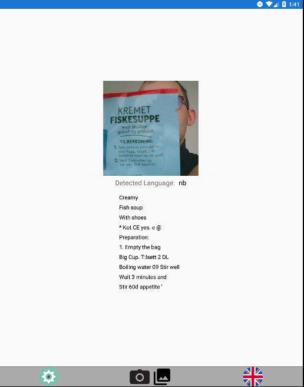
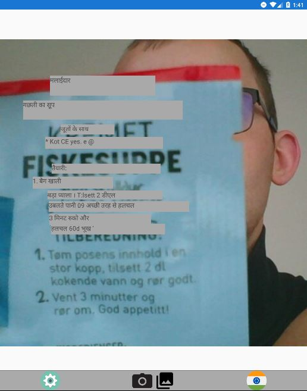

# Image Text Translator v 2.0
### Program overview:
Application requires internet connection! It allows you to translate text, detected from image up to 25 foreign languages.
### Program specification:

- To start translating you may press camera or gallery icon
- Before that you may choose translation destination language in right bottom corner
- You are able to change destination language in any time 
- 'Clear all' option removes all recognized data, and returns to default app state 
- Handwritten Mode. IMPORTANT. For now allows to recognize only english text 
- Available languages to detect: English, Czech, Danish, Dutch, Finnish, French, German, Greek, Hungarian, ChineseSimplified, ChineseTraditional, Italian, Japanese, Korean, Norwegian, Polish, Portuguese, Russian, Spanish, Swedish, Turkish, Romanian, Slovac, Serbian 
- To enter ZOOM mode double tap on image after recognition is complete. To exit double tap again on image or on boxes with text
- To copy recognized and translated text into clipboard just use double click and popup will be triggered.

## Assets:
### Main app page:

### Analyze logic:

### Detect boxes logic (currently in development):

